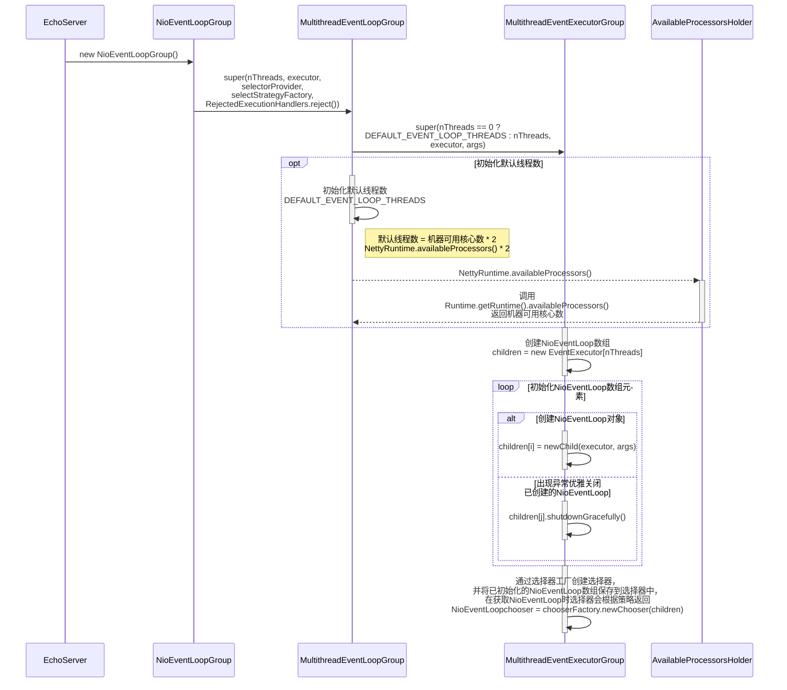
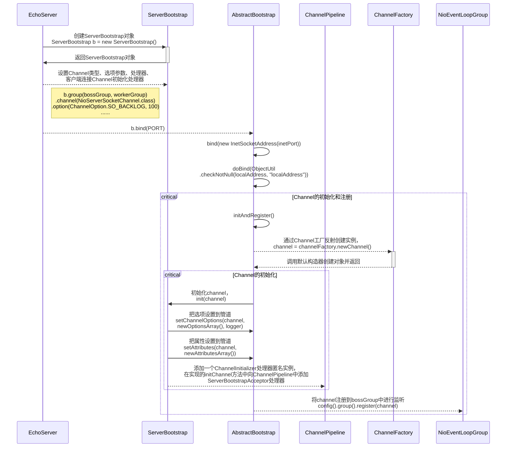
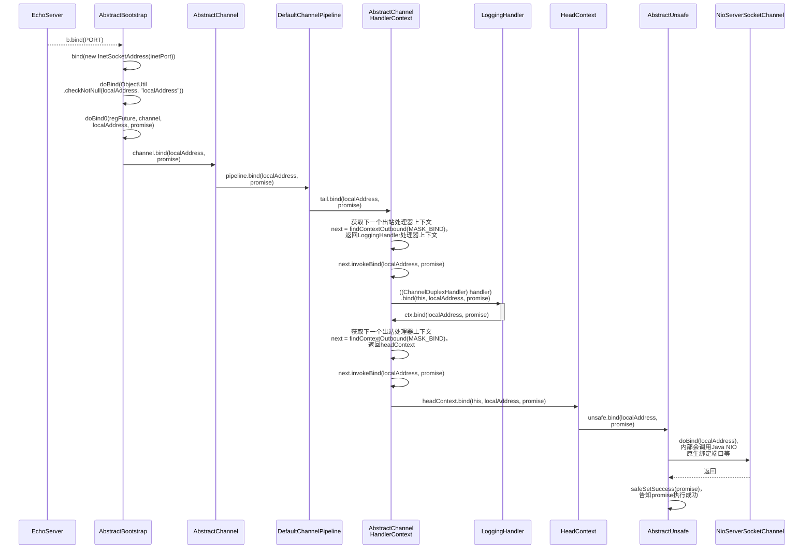

# 基本说明

1. 通过流程图的方式阅读Netty源码，在阅读时参考流程图进行源码debug。
2. 在 io.netty.example 包下，有很多Netty 案例，可以用于分析源码。

# Netty启动过程源码剖析

## 目的和说明

1. 目的：通过分析Netty服务端的启动过程源码，更好的理解Netty的整体设计和运行机制。
2. debug到NioServerSocketChannel的doBind方法。
3. debug到NioEventLoop的run方法。
4. 分析源码使用的案例：https://github.com/hhchun/netty-example/tree/main/netty-example-echo

## 源码剖析过程

### step1：创建线程组（NioEventLoopGroup）



> Netty提供有两种选择器（EventExecutorChooser：事件执行选择器）：
>
> 1. PowerOfTwoEventExecutorChooser：二次幂选择器，当线程数为二次幂才会使用此选择器。
> 2. GenericEventExecutorChooser：通用选择器，循环轮询选择EventLoop。

### step2：初始化和注册Channel



**initAndRegister源码分析：**

1. 通过Channel工厂反射创建channel实例，channel的类型通过ServerBootstrap#channel方法指定。

   ```java
   // AbstractBootstrap#initAndRegister
   
   // 通过Channel工厂反射创建channel实例
   channel = channelFactory.newChannel();
   ```

   ```java
   // EchoServer.java
   
   ServerBootstrap b = new ServerBootstrap();
   b.group(bossGroup, workerGroup)
     // 通过ServerBootstrap指定Channel的类型
     .channel(NioServerSocketChannel.class);
   ```

2. Channel工厂调用NioServerSocketChannel默认构造器，调用SelectorProvider的openServerSocketChannel方法获取Java NIO的channel。

3. NioServerSocketChannel主要创建有：

   1. ChannelId：Channel唯一标识。
   2. NioMessageUnsafe：Netty用于操作原生NIO消息的组件，是比较底层的，这里就不过多讨论。
   3. DefaultChannelPipeline：管道，主要用于ChannelHandler的调度管理，内部是双向链表结构，会过滤所有的出入站消息。
   4. NioServerSocketChannelConfig：存储一些配置，方便外部访问。

   ```java
   // AbstractChannel.java
   
   protected AbstractChannel(Channel parent) {
     this.parent = parent;
     id = newId();
     unsafe = newUnsafe();
     pipeline = newChannelPipeline();
   }
   ```

---

**init源码分析：**

5. 设置NioServerSocketChannel的TCP属性参数，通过ServerBootstrap#option方法添加选项都会被设置到NioServerSocketChannel中。

   ```java
   // ServerBootstrap#init
   setChannelOptions(channel, newOptionsArray(), logger);
   ```

   ```java
   // 通过ServerBootstrap#option方法添加选项
   
   ServerBootstrap b = new ServerBootstrap();
   b.group(bossGroup, workerGroup)
     .channel(NioServerSocketChannel.class)
     // 配置参数
     .option(ChannelOption.SO_BACKLOG, 100);
   ```

   > ServerBootstrap中的options是通过LinkedHashMap进行存储的，LinkedHashMap是非线程安全的，在将ServerBootstrap中的options设置到NioServerSocketChannel之前将options复制一个副本出来再使用。
   >
   > ```java
   > // AbstractBootstrap#newOptionsArray
   > 
   > static Map.Entry<ChannelOption<?>, Object>[] newOptionsArray(Map<ChannelOption<?>, Object> options) {
   >   synchronized (options) {
   >     return new LinkedHashMap<ChannelOption<?>, Object>(options).entrySet().toArray(EMPTY_OPTION_ARRAY);
   >   }
   > }
   > ```

2. 在NioServerSocketChannel的ChannelPipeline中添加一个ChannelInitializer匿名实例，在重写的initChannel方法中向ChannelPipeline中添加一个ServerBootstrapAcceptor处理器。

3. ServerBootstrapAcceptor是一个非常重要的处理器，类中保存着**childChannel**（客户端连接通道）需要的各种属性，它实现ChannelInboundHandler接口，主要实现channelRead方法，当Selector有**OP_ACCEPT**事件到达时，该方法会将各种属性设置到childChannel中，并将childChannel注册到childGroup（workerGroup）。

   ```java
   // ServerBootstrapAcceptor#channelRead
   
   public void channelRead(ChannelHandlerContext ctx, Object msg) {
     final Channel child = (Channel) msg;
   
     child.pipeline().addLast(childHandler);
   
     // 设置各种属性
     setChannelOptions(child, childOptions, logger);
     setAttributes(child, childAttrs);
   
     try {
       // 注册
       childGroup.register(child).addListener(new ChannelFutureListener() {
         @Override
         public void operationComplete(ChannelFuture future) throws Exception {
           if (!future.isSuccess()) {
             forceClose(child, future.cause());
           }
         }
       });
     } catch (Throwable t) {
       forceClose(child, t);
     }
   }
   ```

---

8. 回到initAndRegister方法，NioServerSocketChannel初始化完成之后，会将它注册到parentGroup（bosstGroup）中。<span id="register"> </span>

   ```java
   // AbstractBootstrap#initAndRegister
   
   ChannelFuture regFuture = config().group().register(channel);
   ```

### step3：doBind



1. bootstrap的doBind方法会调用pipeline的bind方法，pipeline会调度执行handler链的bind方法，bind方法是ChannelOutboundHandler的方法。
2. 从handler链的尾部向前执行handler的bind方法，handler链的头部是HeadContext，HeadContext的bind方法会调用AbstractUnsafe的doBind方法，方法中会调用Java NIO原生ServerSocketChannel的bind方法完成绑定端口等工作。
3. 到此channel准备工作已完成，Selector可以开始监听OP_ACCEPT事件，[在前面的initAndRegister方法](#register)已将channel注册到parentGroup（bosstGroup）中。

# Netty接收请求过程源码剖析

## 目的和说明

1. 通过阅读源码的方式分析Netty启动后是如何接收客户端请求的。
2. 从前面分析服务端启动的源码中，已得知NioServerSocketChannel已注册到bossGroup线程池，并关心OP_ACCEPT事件，等待客户端的连接。
3. 先简单说一下EventLoop的逻辑，后续的章节会进行详细的讲解。
   1. 有条件的等待的NIO事件。
   2. 处理NIO事件。
   3. 处理消息队列中的任务。
4. 分析源码使用的案例：https://github.com/hhchun/netty-example/tree/main/netty-example-echo

## 原理剖析过程

# Pipeline、Handler、HandlerContext创建源码剖析

# ChannelPipeline调度ChannelHandler过程源码剖析

# Netty心跳（heartbeat）源码剖析

# Netty核心组件EventLoop源码剖析

# 在Handler或Context中添加线程池源码剖析