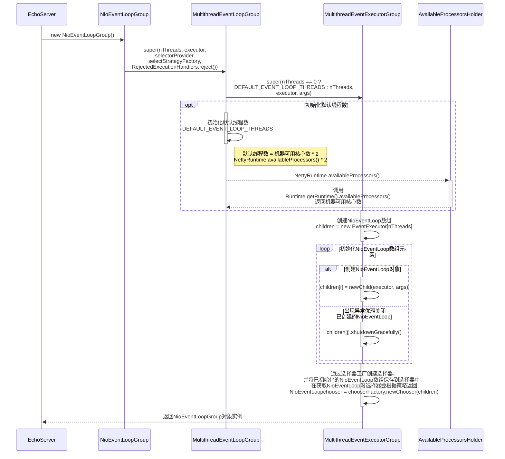
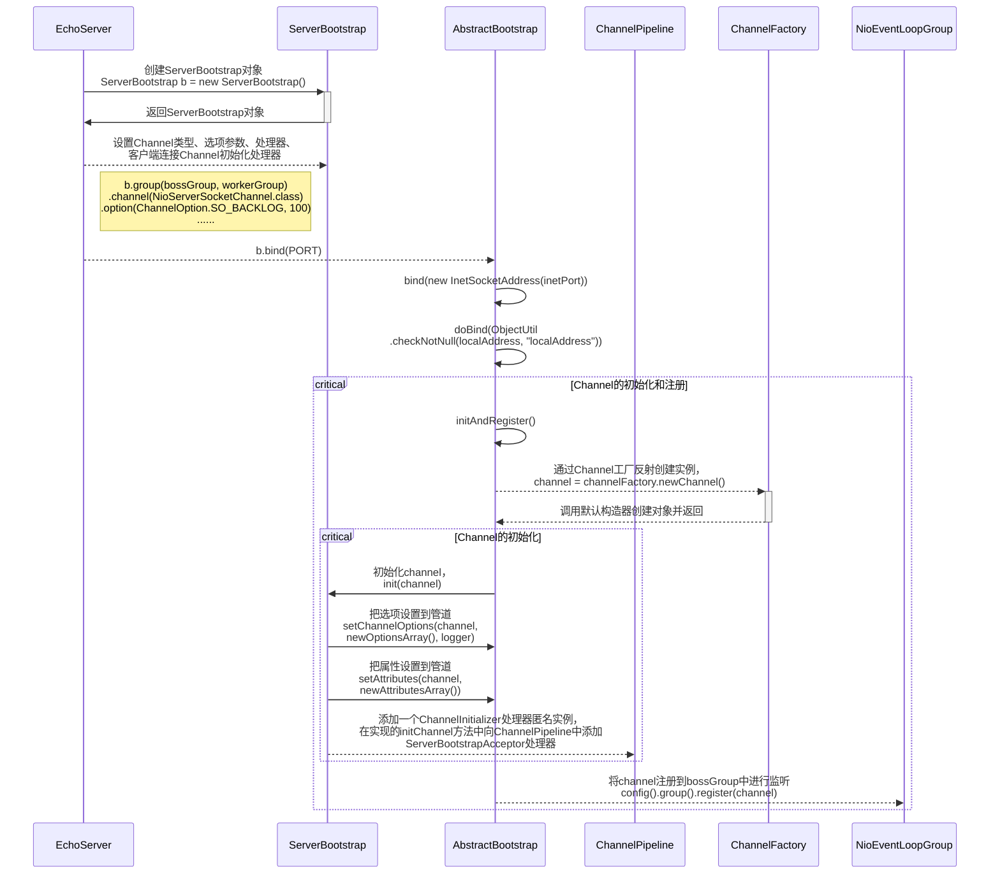
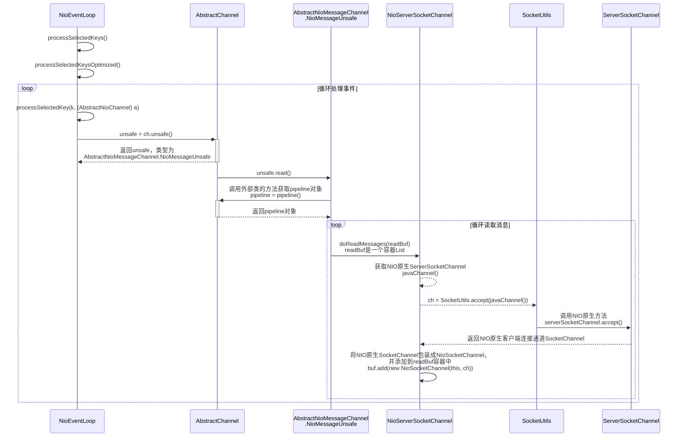
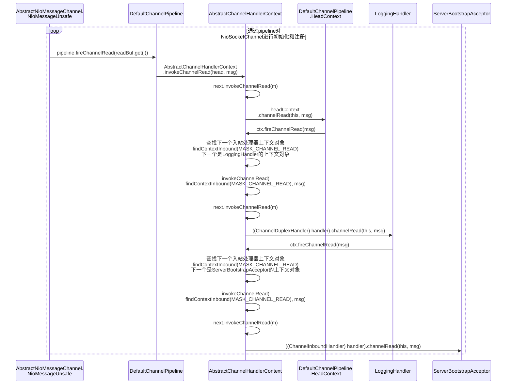
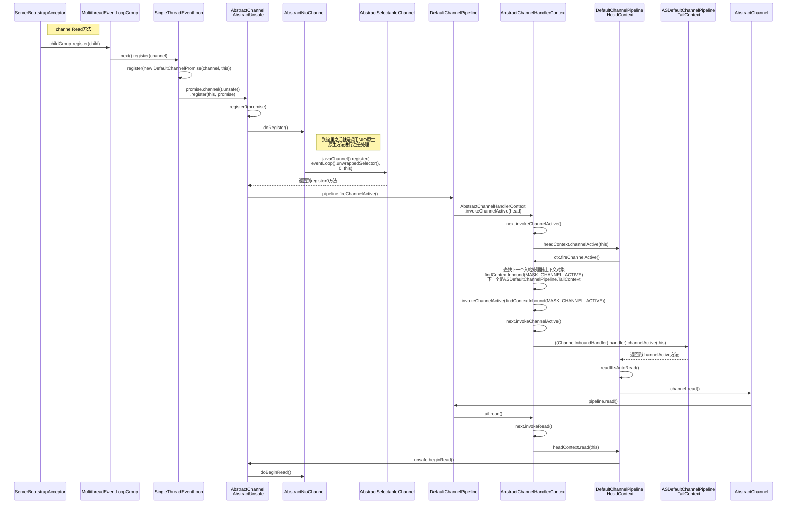
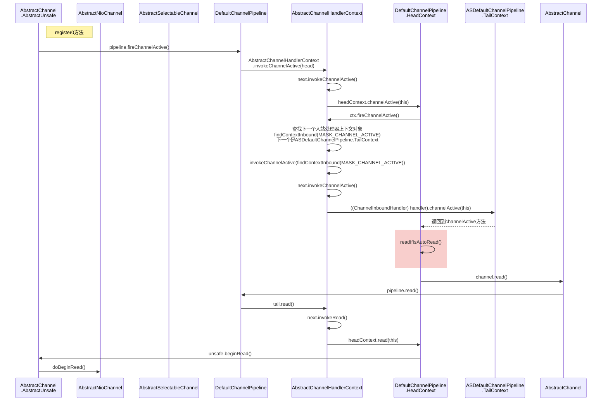

# 基本说明

1. 通过流程图的方式阅读Netty源码，在阅读时参考流程图进行源码debug。
2. 在 io.netty.example 包下，有很多Netty 案例，可以用于分析源码。

# Netty启动过程源码剖析

## 目的和说明

1. 目的：通过分析Netty服务端的启动过程源码，更好的理解Netty的整体设计和运行机制。
2. debug到NioServerSocketChannel的doBind方法。
3. debug到NioEventLoop的run方法。
4. 分析源码使用的案例：https://github.com/hhchun/netty-example/tree/main/netty-example-echo

## 源码剖析过程

### step1：创建事件循环线程组（NioEventLoopGroup）



1. 调用NioEventLoopGroup构造器创建事件循环线程组，可指定线程数，如果不指定会使用默认值（DEFAULT_EVENT_LOOP_THREADS），默认线程数 = 当前机器可用核心数 * 2，DEFAULT_EVENT_LOOP_THREADS是MultithreadEventLoopGroup类的常量，在静态代码块中进行初始化，通过Runtime.getRuntime().availableProcessors()获取当前机器可用核心数。

   ```java
   // MultithreadEventLoopGroup.java
   
   DEFAULT_EVENT_LOOP_THREADS = Math.max(1, SystemPropertyUtil.getInt(
         "io.netty.eventLoopThreads", NettyRuntime.availableProcessors() * 2));
   ```

   ```java
   // NettyRuntime.AvailableProcessorsHolder#availableProcessors
   
   @SuppressForbidden(reason = "to obtain default number of available processors")
   synchronized int availableProcessors() {
     if (this.availableProcessors == 0) {
       final int availableProcessors =
         SystemPropertyUtil.getInt(
         "io.netty.availableProcessors",
         // 获取当前机器可用核心数
         Runtime.getRuntime().availableProcessors());
       setAvailableProcessors(availableProcessors);
     }
     return this.availableProcessors;
   }
   ```

2. 创建一个NioEventLoop数组，容量大小为线程数，循环调用newChild方法创建NioEventLoop实例，并赋值到数组中，如果在过程中出现异常会循环优雅关闭已创建的NioEventLoop。通过选择器工厂创建一个选择器，并将NioEventLoop数组保存到选择器中，如果后续要使用NioEventLoop，选择器会根据策略提供返回。<span id="chooser选择器"> </span>

   ```java
   protected MultithreadEventExecutorGroup(int nThreads, Executor executor,
                                           EventExecutorChooserFactory chooserFactory, Object... args) {
     if (executor == null) {
       executor = new ThreadPerTaskExecutor(newDefaultThreadFactory());
     }
     
     // 创建一个NioEventLoop数组，容量大小为线程数
     children = new EventExecutor[nThreads];
   
     for (int i = 0; i < nThreads; i ++) {
       boolean success = false;
       try {
         children[i] = newChild(executor, args);
         success = true;
       } catch (Exception e) {
         // TODO: Think about if this is a good exception type
         throw new IllegalStateException("failed to create a child event loop", e);
       } finally {
         if (!success) {
           // 出现异常会循环优雅关闭已创建的NioEventLoop
           for (int j = 0; j < i; j ++) {
             children[j].shutdownGracefully();
           }
         }
       }
     }
     // 选择器工厂创建一个选择器，并将NioEventLoop数组保存到选择器中
     chooser = chooserFactory.newChooser(children);
     
     // ...
   }
   ```

   > Netty提供有两种选择器（EventExecutorChooser：事件执行选择器）：
   >
   > 1. PowerOfTwoEventExecutorChooser：二次幂选择器，当线程数为二次幂才会使用此选择器。
   > 2. GenericEventExecutorChooser：通用选择器，循环轮询选择EventLoop。

### step2：初始化和注册Channel



**initAndRegister源码分析：**

1. 通过Channel工厂反射创建channel实例，channel的类型通过ServerBootstrap#channel方法指定。

   ```java
   // AbstractBootstrap#initAndRegister
   
   // 通过Channel工厂反射创建channel实例
   channel = channelFactory.newChannel();
   ```

   ```java
   // EchoServer.java
   
   ServerBootstrap b = new ServerBootstrap();
   b.group(bossGroup, workerGroup)
     // 通过ServerBootstrap指定Channel的类型
     .channel(NioServerSocketChannel.class);
   ```

2. Channel工厂调用NioServerSocketChannel默认构造器，调用SelectorProvider的openServerSocketChannel方法获取NIO原生的channel。

3. NioServerSocketChannel主要创建有：

   1. ChannelId：Channel唯一标识。
   2. NioMessageUnsafe：Netty用于操作原生NIO消息的组件，是比较底层的，这里就不过多讨论。
   3. DefaultChannelPipeline：管道，主要用于ChannelHandler的调度管理，内部是双向链表结构，会过滤所有的出入站消息。
   4. NioServerSocketChannelConfig：存储一些配置，方便外部访问。

   ```java
   // AbstractChannel.java
   
   protected AbstractChannel(Channel parent) {
     this.parent = parent;
     id = newId();
     unsafe = newUnsafe();
     pipeline = newChannelPipeline();
   }
   ```

---

**init源码分析：**

5. 设置NioServerSocketChannel的TCP属性参数，通过ServerBootstrap#option方法添加选项都会被设置到NioServerSocketChannel中。

   ```java
   // ServerBootstrap#init
   setChannelOptions(channel, newOptionsArray(), logger);
   ```

   ```java
   // 通过ServerBootstrap#option方法添加选项
   
   ServerBootstrap b = new ServerBootstrap();
   b.group(bossGroup, workerGroup)
     .channel(NioServerSocketChannel.class)
     // 配置参数
     .option(ChannelOption.SO_BACKLOG, 100);
   ```

   > ServerBootstrap中的options是通过LinkedHashMap进行存储的，LinkedHashMap是非线程安全的，在将ServerBootstrap中的options设置到NioServerSocketChannel之前将options复制一个副本出来再使用。
   >
   > ```java
   > // AbstractBootstrap#newOptionsArray
   > 
   > static Map.Entry<ChannelOption<?>, Object>[] newOptionsArray(Map<ChannelOption<?>, Object> options) {
   >   synchronized (options) {
   >     return new LinkedHashMap<ChannelOption<?>, Object>(options).entrySet().toArray(EMPTY_OPTION_ARRAY);
   >   }
   > }
   > ```

2. 在NioServerSocketChannel的ChannelPipeline中添加一个ChannelInitializer匿名实例，在重写的initChannel方法中向ChannelPipeline中添加一个ServerBootstrapAcceptor处理器。

3. ServerBootstrapAcceptor是一个非常重要的处理器，类中保存着**childChannel**（客户端连接通道）需要的各种属性，它实现ChannelInboundHandler接口，主要实现channelRead方法，当Selector有**OP_ACCEPT**事件到达时，该方法会将各种属性设置到childChannel中，并将childChannel注册到childGroup（workerGroup）。

   ```java
   // ServerBootstrapAcceptor#channelRead
   
   public void channelRead(ChannelHandlerContext ctx, Object msg) {
     final Channel child = (Channel) msg;
   
     child.pipeline().addLast(childHandler);
   
     // 设置各种属性
     setChannelOptions(child, childOptions, logger);
     setAttributes(child, childAttrs);
   
     try {
       // 注册
       childGroup.register(child).addListener(new ChannelFutureListener() {
         @Override
         public void operationComplete(ChannelFuture future) throws Exception {
           if (!future.isSuccess()) {
             forceClose(child, future.cause());
           }
         }
       });
     } catch (Throwable t) {
       forceClose(child, t);
     }
   }
   ```

---

8. 回到initAndRegister方法，NioServerSocketChannel初始化完成之后，会将它注册到parentGroup（bosstGroup）中。<span id="register"> </span>

   ```java
   // AbstractBootstrap#initAndRegister
   
   ChannelFuture regFuture = config().group().register(channel);
   ```

### step3：doBind


1. bootstrap的doBind方法会调用pipeline的bind方法，pipeline会调度执行handler链的bind方法，bind方法是ChannelOutboundHandler的方法。
2. 从handler链的尾部向前执行handler的bind方法，handler链的头部是HeadContext，HeadContext的bind方法会调用AbstractUnsafe的doBind方法，方法中会调用NIO原生ServerSocketChannel的bind方法完成绑定端口等工作。
3. 到此channel准备工作已完成，selector可以开始监听OP_ACCEPT事件，[在前面的initAndRegister方法](#register)已将channel注册到parentGroup（bosstGroup）中。

# Netty接收请求过程源码剖析

## 目的和说明

1. 通过阅读源码的方式分析Netty启动后是如何接收客户端请求的。
2. 从前面分析服务端启动的源码中，已得知NioServerSocketChannel已注册到bossGroup（parentGroup）事件循环线程组，并关心OP_ACCEPT事件，等待客户端的连接。
3. 已注册的NioServerSocketChannel由bossGroup中其中一个EventLoop来进行处理，在分析源码debug时可以从此类入手，断点打在run方法的processSelectedKeys()位置上。
4. 先简单说一下EventLoop的逻辑，后续的章节会进行详细的讲解。
   1. 有条件的等待的NIO事件。
   2. 处理NIO事件。
   3. 处理消息队列中的任务。
5. 分析源码使用的案例：https://github.com/hhchun/netty-example/tree/main/netty-example-echo

## 原理剖析过程

### step 1：接收客户端连接，创建NioSocketChannel



1. 当有关心的事件发生，NioEventLoop调用processSelectedKeys方法循环处理事件，每个事件都由processSelectedKey方法进行处理。客户端连接事件（OP_ACCEPT）由AbstractNioMessageChannel.NioMessageUnsafe#read方法进行处理。

   ```java
   // NioEventLoop#processSelectedKey
   
   private void processSelectedKey(SelectionKey k, AbstractNioChannel ch) {
     // 获取NioServerSocketChannel的unsafe，类型为AbstractNioMessageChannel.NioMessageUnsafe
     final AbstractNioChannel.NioUnsafe unsafe = ch.unsafe();
     
     // ...
     
     try {
       // 事件类型
       int readyOps = k.readyOps();
   
       // ...
       
       // Also check for readOps of 0 to workaround possible JDK bug which may otherwise lead
       // to a spin loop
       if ((readyOps & (SelectionKey.OP_READ | SelectionKey.OP_ACCEPT)) != 0 || readyOps == 0) {
         // 处理客户端连接事件（OP_ACCEPT）
         unsafe.read();
       }
     } catch (CancelledKeyException ignored) {
       unsafe.close(unsafe.voidPromise());
     }
   }
   ```

2. 在read方法中调用NioServerSocketChannel#doReadMessages方法获取NioSocketChannel（客户端连接通道），在此过程中会调用NIO原生的ServerSocketChannel#accept方法获取SocketChannel，将SocketChannel包装成NioSocketChannel，并添加到readBuf容器中。

   ```java
   // AbstractNioMessageChannel.NioMessageUnsafe
   
   private final class NioMessageUnsafe extends AbstractNioUnsafe {
     // 容器
     private final List<Object> readBuf = new ArrayList<Object>();
   
     @Override
     public void read() {
       // ...
       try {
         try {
           do {
             // 获取NioSocketChannel（客户端连接通道）
             int localRead = doReadMessages(readBuf);
             if (localRead == 0) {
               break;
             }
             if (localRead < 0) {
               closed = true;
               break;
             }
             // ...
           } while (continueReading(allocHandle));
         } catch (Throwable t) {
           exception = t;
         }
       } finally {
         // ...
       }
     }
   }
   ```

   ```java
   // NioServerSocketChannel#doReadMessages
   
   protected int doReadMessages(List<Object> buf) throws Exception {
     // 使用工具类获取SocketChannel
     SocketChannel ch = SocketUtils.accept(javaChannel());
     
     try {
       if (ch != null) {
         // 将SocketChannel包装成NioSocketChannel，并添加到readBuf容器中
         buf.add(new NioSocketChannel(this, ch));
         return 1;
       }
     } catch (Throwable t) {
       // ...
     }
   
     return 0;
   }
   ```

   ```java
   // SocketUtils#accept
   
   public static SocketChannel accept(final ServerSocketChannel serverSocketChannel) throws IOException {
     try {
       return AccessController.doPrivileged(new PrivilegedExceptionAction<SocketChannel>() {
         @Override
         public SocketChannel run() throws IOException {
           // 调用NIO原生的ServerSocketChannel的accept方法获取SocketChannel
           return serverSocketChannel.accept();
         }
       });
     } catch (PrivilegedActionException e) {
       throw (IOException) e.getCause();
     }
   }
   ```

### step 2：调用pipeline的handler链对客户端连接通道NioSocketChannel进行初始化和注册



1. 注意：这里的pipeline指的是**NioServerSocketChannel中的pipeline**。

2. 当获取到NioSocketChannel后，会循环调用pipeline的fireChannelRead方法对每个NioSocketChannel进行处理，fireChannelRead方法会使用责任链的方式依次调用handler的channelRead方法对NioSocketChannel进行处理。

   ```java
   private final class NioMessageUnsafe extends AbstractNioUnsafe {
     // 容器
     private final List<Object> readBuf = new ArrayList<Object>();
     
     @Override
     public void read() {
       // ...
       try {
         try {
           do {
             // 获取NioSocketChannel（客户端连接通道）
             int localRead = doReadMessages(readBuf);
             if (localRead == 0) {
               break;
             }
             if (localRead < 0) {
               closed = true;
               break;
             }
             // ...
           } while (continueReading(allocHandle));
         } catch (Throwable t) {
           exception = t;
         }
         
         int size = readBuf.size();
         for (int i = 0; i < size; i ++) {
           readPending = false;
           // 循环调用pipeline的fireChannelRead方法对每个NioSocketChannel进行处理
           pipeline.fireChannelRead(readBuf.get(i));
         }
         // ...
       } finally {
         // ...
       }
     }
   }
   ```

3. 在handler链中有一个ServerBootstrapAcceptor类型的handler，是一个很重要的handler，特别是**channelRead方法**。

   ```java
   // ServerBootstrap.ServerBootstrapAcceptor
   
   public void channelRead(ChannelHandlerContext ctx, Object msg) {
     final Channel child = (Channel) msg;
     // 1. 将保存在ServerBootstrap对象中的childHandler添加到NioSocketChannel中
     child.pipeline().addLast(childHandler);
     
     // 2. 将保存在ServerBootstrap对象中的childOptions添加到NioSocketChannel中
     setChannelOptions(child, childOptions, logger);
     setAttributes(child, childAttrs);
   
     try {
       // 3. 将NioSocketChannel注册到childGroup（workerGroup）中
       childGroup.register(child).addListener(new ChannelFutureListener() {
         @Override
         public void operationComplete(ChannelFuture future) throws Exception {
           if (!future.isSuccess()) {
             forceClose(child, future.cause());
           }
         }
       });
     } catch (Throwable t) {
       forceClose(child, t);
     }
   }
   ```

   **channelRead方法主要完成的工作：**

   1. 将保存在ServerBootstrap对象中的childHandler添加到NioSocketChannel中，childHandler是在创建ServerBootstrap对象后通过childHandler方法进行添加的。

      ```java
      // EchoServer.java
      
      final EchoServerHandler serverHandler = new EchoServerHandler();
      ServerBootstrap b = new ServerBootstrap();
      b.group(bossGroup, workerGroup)
        // ...
        
        // 添加handler
        .childHandler(new ChannelInitializer<SocketChannel>() {
          @Override
          public void initChannel(SocketChannel ch) throws Exception {
            ChannelPipeline p = ch.pipeline();
            if (sslCtx != null) {
              p.addLast(sslCtx.newHandler(ch.alloc()));
            }
            p.addLast(serverHandler);
          }
        });
      ```

   2. 将保存在ServerBootstrap对象中的childOptions设置到NioSocketChannel中，childOptions也是在创建ServerBootstrap对象后进行添加的。

      ```java
      // EchoServer.java
      
      ServerBootstrap b = new ServerBootstrap();
      b.group(bossGroup, workerGroup)
        // ...
        // 添加option
        .childOption(ChannelOption.SO_KEEPALIVE, true);
      ```

   3. 将NioSocketChannel注册到childGroup（workerGroup）中，childGroup也是在创建ServerBootstrap对象后进行指定的。**[下一小节对注册流程的源码进行详细分析](#step 3：将客户端连接通道NioSocketChannel注册到childGroup（WorkerGroup）)。**

      ```java
      // EchoServer.java
      
      // 创建childGroup（workerGroup）
      EventLoopGroup workerGroup = new NioEventLoopGroup();
      
      ServerBootstrap b = new ServerBootstrap();
      // ...
      // 指定childGroup（workerGroup）
      b.group(bossGroup, workerGroup);
      ```

      > childGroupd的类型是NioEventLoopGroup，NioEventLoopGroup的创建流程源码请参考：[创建NioEventLoopGroup](#step1：创建事件循环线程组（NioEventLoopGroup）)。

### step 3：将客户端连接通道NioSocketChannel注册到childGroup（workerGroup）

接着上一小节，对NioSocketChannel注册到childGroup（WorkerGroup）过程的源码进行详细分析。



1. 将NioSocketChannel注册到childGroup，实际上是将NioSocketChannel注册到childGroup里的其中一个NioEventLoop中去，注册成功后NioEventLoop会对NioSocketChannel进行监听。

2. 到底是注册到哪个NioEventLoop中，是由next方法来分配的，方法中的实现是由选择器（chooser）根据策略来返回的，这个选择器是在创建childGroup时创建的，[**前面的章节**](#chooser选择器)提到过。

3. 获取当前客户端连接通道NioSocketChannel对象的unsafe属性，调用unsafe的register方法，在register方法中会继续调用外部类AbstractNioChannel的doRegister方法，在doRegister方法中会获取到NioSocketChannel对应的NIO原生SocketChannel对象，并调用其register方法注册到当前NioEventLoop的Selector中。

   > 补充：
   >
   > * NioSocketChannel继承了AbstractNioChannel类。
   > * unsafe属性是在NioSocketChannel构造器中进行创建的。

   ```java
   // AbstractNioChannel#doRegister
   
   protected void doRegister() throws Exception {
     boolean selected = false;
     for (;;) {
       try {
         // 注意：参数中this的值就是当前NioSocketChannel对象，将this作为att保存在SocketChannel中，将两者关联到一起
         //      后续使用时能够快速方便的获取到NioSocketChannel对象。
         selectionKey = javaChannel().register(eventLoop().unwrappedSelector(), 0, this);
         return;
       } catch (CancelledKeyException e) {
         // ...
       }
     }
   }
   ```

4. 到此注册已基本完成，接下来就是将客户端通道NioSocketChannel设置为开始监听读事件，[下一个小节会详细分析](#step 4：将客户端通道NioSocketChannel设置为开始监听读事件)。

### step 4：将客户端通道NioSocketChannel设置为开始监听读事件

上一小节中，已经完成注册，接下来将NioSocketChannel设置为开始监听读事件。



1. 调用NioSocketChannel对应的pipeline的fireChannelActive方法， 方法中会通过责任链的方式依次调用handler的channelInactive方法。

2. 需要特别注意的是HeadContext处理器的channelActive方法，在方法的最后会调用readIfIsAutoRead方法，在方法中会通过pipeline调用read方法，最终会调用HeadContext的read方法。

3. HeadContext的read方法会调用unsafe的beginRead方法，beginRead方法接着调用doBeginRead方法，doBeginRead方法是AbstractNioChannel类的方法，在方法中主要将NIO原生的SelectionKey设置为关系读事件（OP_READ）。

   ```java
   // AbstractNioChannel#doBeginRead
   
   protected void doBeginRead() throws Exception {
     // Channel.read() or ChannelHandlerContext.read() was called
     final SelectionKey selectionKey = this.selectionKey;
     if (!selectionKey.isValid()) {
       return;
     }
   
     readPending = true;
   
     final int interestOps = selectionKey.interestOps();
     if ((interestOps & readInterestOp) == 0) {
       // 参数值：1（OP_READ）
       selectionKey.interestOps(interestOps | readInterestOp);
     }
   }
   ```

# Pipeline、Handler、HandlerContext创建源码剖析

# ChannelPipeline调度ChannelHandler过程源码剖析

# Netty心跳（heartbeat）源码剖析

# Netty核心组件EventLoop源码剖析

# 在Handler或Context中添加线程池源码剖析